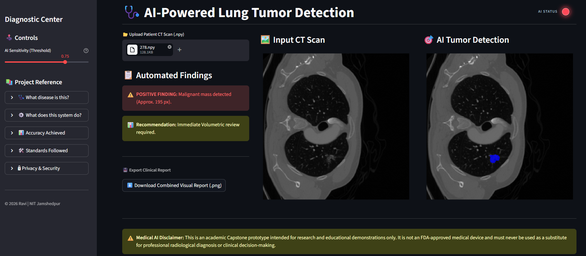

# Lung Tumor Vision AI 🫁

An end-to-end Medical Imaging pipeline and deployment dashboard using a **U-Net** deep learning architecture to segment malignant lung tumors from CT scans.

## 📌 Project Overview
This project uses Deep Learning to assist radiologists by automatically identifying and masking malignant nodules in lung CT scans. It features an **Adaptive Digital Image Processing (DIP) Pipeline** to handle raw Hounsfield Units (HU), utilizes the **Dice Coefficient** to conquer class imbalance in medical data, and includes a clinical Streamlit dashboard for real-time inference.

**🏆 Current Baseline Performance:** Achieved a Validation Dice Score of **53.43%** on unseen patient data after 15 epochs.

## 🛠️ Tech Stack
* **Language:** Python 3.10+
* **Deep Learning:** PyTorch
* **Data Processing:** NumPy, Nibabel
* **Visualization:** Matplotlib, tqdm (Progress tracking)
* **UI & Deployment:** Streamlit

**👁️Preview of app**
----


## 📁 Project Structure
```text
lung-tumor-vision-ai/
├── data/               # Raw and Processed .npy CT slices (Ignored in Git)
├── models/             # Trained .pth model weights (Ignored in Git)
├── notebooks/          # Data exploration & DIP experiments
├── src/                # Modular Core Engine
│   ├── dataset.py      # Custom PyTorch Dataset & Normalization
│   ├── unet.py         # U-Net Model Architecture
│   ├── metrics.py      # Dice Loss & IoU implementation
│   ├── train.py        # Lightweight local training tester
│   ├── train_colab.py  # Heavy cloud training script with graphs & auto-saves
│   ├── evaluate.py     # Patient-level validation tester
│   └── predict.py      # Inference & Visualization script
├── app.py              # 🚀 Streamlit Clinical Dashboard
└── requirements.txt    # Optimized deployment dependencies

🚀 Getting Started
1. Clone & Setup Environment

## 🚀 Get Started

## Clone the Repository
git clone https://github.com/RaviKumarYadav15/lung-tumor-vision-ai.git

python -m venv venv
source venv/bin/activate  # On Windows: .\venv\Scripts\activate
pip install -r requirements.txt
(Note: You will need to add the data/raw/ and models/ folders locally, as heavy files are omitted from version control via .gitignore.)

2. Training the Model
To test the pipeline locally on a CPU/small GPU:

python src/train.py
To train the full model on a cloud GPU (e.g., Google Colab), run:

python src/train_colab.py
3. Evaluating & Visualizing
To evaluate the model's performance on an entire unseen validation patient:

python src/evaluate.py
To generate matplotlib visual comparisons (Patient CT vs. True Mask vs. AI Prediction):

python src/predict.py
4. Launching the Clinical Dashboard 🩺
To start the interactive Streamlit web application:

streamlit run app.py
📊 Methodology (DIP & AI)
Adaptive Data Pipeline: Intelligently detects whether incoming data is raw Hounsfield Units (-1000 to 400 HU) or pre-normalized [0, 1] arrays, preventing visualization blackouts ("White-Out Hallucination") during inference.

Segmentation: A 4-level U-Net (MICCAI Standard) captures deep spatial features via skip-connections.

Evaluation: Uses Dice Loss to prioritize exact geometric overlap with the tumor rather than background accuracy, preventing the AI from lazily guessing "healthy tissue" on imbalanced scans.

⚖️ License & Credits
This project was developed for educational purposes as part of a 6th-semester Capstone project at NIT Jamshedpur.
Author: Ravi Kumar Yadav
